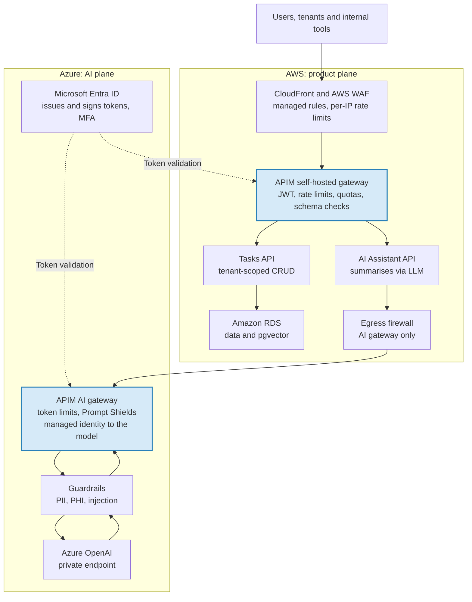

# Architecture Diagram

```mermaid
flowchart TB
    Users["Users, tenants and internal tools"]

    subgraph AWS["AWS: product plane"]
        WAF["CloudFront and AWS WAF<br/>managed rules, per-IP rate limits"]
        Gateway["APIM self-hosted gateway<br/>JWT, rate limits, quotas, schema checks"]
        
        TasksAPI["Tasks API<br/>tenant-scoped CRUD"]
        AssistantAPI["AI Assistant API<br/>summarises via LLM"]
        
        RDS["Amazon RDS<br/>data and pgvector"]
        Egress["Egress firewall<br/>AI gateway only"]
    end

    subgraph Azure["Azure: AI plane"]
        Entra["Microsoft Entra ID<br/>issues and signs tokens, MFA"]
        
        AIGateway["APIM AI gateway<br/>token limits, Prompt Shields<br/>managed identity to the model"]
        
        Guardrails["Guardrails<br/>PII, PHI, injection"]
        OpenAI["Azure OpenAI<br/>private endpoint"]
    end

    Users --> WAF
    WAF --> Gateway
    Gateway --> TasksAPI
    Gateway --> AssistantAPI
    TasksAPI --> RDS
    AssistantAPI --> Egress

    Entra -.->|Token validation| Gateway
    Entra -.->|Token validation| AIGateway

    Egress --> AIGateway
    AIGateway --> Guardrails
    Guardrails --> OpenAI
    OpenAI --> Guardrails
    Guardrails --> AIGateway

    classDef policy fill:#d6eaf8,stroke:#2980b9,stroke-width:2px
    class Gateway,AIGateway policy
```
